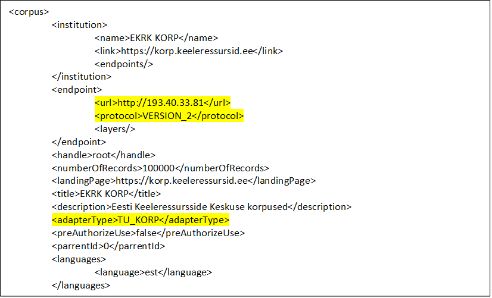
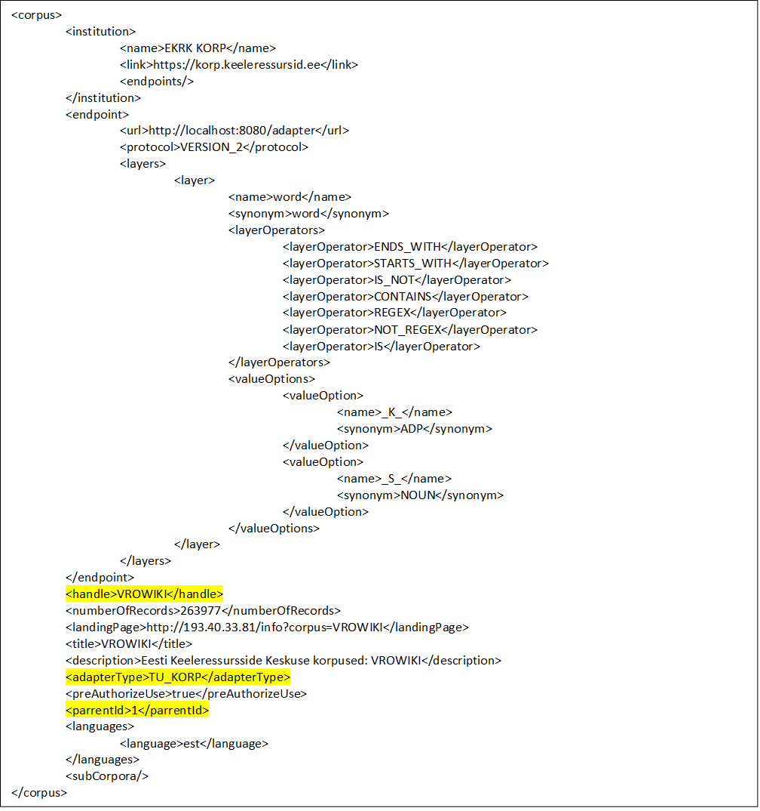

EKRK RABA Front-End

Kasutus- ja paigaldusjuhend

## Sisukord

- [Sissejuhatus](#sissejuhatus)
- [Installeerimine ning käivitamine](#installeerimine-ning-käivitamine)
  - [Eelnõuded](#eelnõuded)
  - [Installeerimine ja käivitamine](#installeerimine-ja-käivitamine) 
- [Kasutamisest](#kasutamisest)
  - [Back-end liidestamine](#back-end-liidestamine)
  - [Registreerimine ja kasutaja autentimine](#registreerimine-ja-kasutaja-autentimine)
  - [Abilehe täiendamine](#abilehe-täiendamine)
- [Internatsionaliseeritavus](#internatsionaliseeritavus)
  - [Tõlked](#tõlked)
- [EL logo suuruse muutmine](#EL-logo-suuruse-muutmine)
- [RABA logo asetamine lehe päisesse](#RABA-logo-asetamine-lehe-päisesse)

## Sissejuhatus

Antud RABA kasutajaliides võimaldab teostada CQL ja FCS-QL keeles päringuid määratud korpustest ning vastavaid tulemusi kuvada ekraanil. 

## Installeerimine ning käivitamine

### Eelnõuded

Enne installeerimist tuleb vastavasse arvutisse installeerida uusim NodeJS ning yarn (https://nodejs.org/en/ ning https://yarnpkg.com/en/).

### Installeerimine ja käivitamine

Rakenduse käivitamiseks localhostis tuleb esmalt käsurealt (cmd) minna lähtekoodi hoidvasse kausta ning sisestada käsureale 'yarn install'. Seejärel laetakse alla ning installeeritakse kõik vajalikud paketid rakenduse käivitamiseks.

Järgnevalt tuleb sisestada käsklus 'yarn start', mille järel käivitatakse rakendus vaikimisi kasutatavaks määratud veebilehitsejas aadressil localhost:3000.

## Kasutamisest

Hetkel on võimalik teostada otsinguid, näha otsingurida, otsingunuppu, vahetada lihtotsingu (CQL) ning laiendatud (FCS-QL) otsingu moodi vahel, eksisteerib ka kasutaja sisselogimise lehekülg ning abilehekülg. Viimasel on hetkel kirjeldatud otsingute tegemine.

Kasutajaliides võimaldab vahetada ka keeli, vajutades vastava lipu peale (Eesti, Inglise). Võimaldatud on ka kasutajate registreerimine ja sisse logimine. Oauth 2.0 läbi väliste teenuste on hetkel testimisel aga lokaalselt on autentimine võimaldatud. Hetkeseisuga on kõik kasutajad vaikimisi tavakasutaja rollis, kes saavad ligi ka hiljem administraatorile mõeldud funktsionaalsustele (mis hetkel olemas).

### Back-end liidestamine

Ühendamaks back-end'iga, tuleb src > assets > js > constants > constants.jsx failis olevale const back_end_host juurde märkida back-end'i URL.

### Registreerimine ja kasutaja autentimine

Võimaldatud on ka kasutajate registreerimine ja sisse logimine. Hetkeseisuga on võimalik eristada tavakasutajate ja adminstraatori vahel. Administraatoril on võimalik ligi pääseda kasutajate halduse lehele, kus on võimalik anda juurde ka teistele kasutajatele administreerimiseks vajalikke õigusi. Samuti on adminstraatoril võimalik vaadelda logisid ning pääseda ligi endpointide haldusele.

Kasutaja lokaalseks registreerimiseks on vaja navigeerida läbi login lehekülje registreerimise leheküljele, kus tuleb täita vastavad lahtrid ning vajutada nuppu registreeri. Eduka registreerimise järgselt logitakse kasutaja ka koheselt sisse ning suunatakse agregaatori otsingu lehele. Mitte õnnestunud registreerimise kohta kuvatakse kasutajale ka vastava sisulist tagasidet koos näpunäidetega, kuidas probleemi oleks võimalik lahendada.

Kasutaja sisse logimiseks on vaja vastavalt navigeerida sisse logimise leheküljele ning täita vajalikud lahtrid. Eduka sisenemise korral suunatakse kasutaja edasi agregaatori lehele. Ebaõnnestunud autentimise korral aga kuvatakse võimalikke probleeme ning näpunäiteid probleemi lahendamiseks.

Hetkel välja logimiseks tuleb samuti minna esialgsele lehele, kust logiti sisse. Seal on nüüd võimalik klõpsata vastaval nupul, mis lõpetab sisse logitud sessiooni.

Sisse on võimalik logida ka kasutades OAuth 2.0 ja SAML 2.0 protokolle. Hetkel on demonstratiivselt OAuth 2.0 jaoks seadistatud GitHub. GitHub'iga edukalt sisse logimiseks on vajalik, et potentsiaalsel kasutajal on oma GitHub'i profiilis avalikuks määratud tema kasutajanimi (name) ning e-mail. Kui SAML 2.0 seadistamine toimub peamiselt back-end'i poolt, siis OAuth'i jaoks on vaja ära määrata vastavad URL'id, mis on hetkel võimalik leida failist /assets/js/consants/constants.jsx. Samuti on sisse logimise leheküljel vastavalt GitHub'i logoga nupp, mida on võimalik ära kaotada või tagasi tuua failist /assets/js/pages/loginpage.jsx ridadelt 214-217.

### Abilehe täiendamine

Abilehe täiendamiseks tuleb lisada vajalik tekst (pealkiri, lõik) sõnaraamatusse src > translations > dictionary.js faili helppage jaotuse alla (igas olemasolevas keeles).

Seejärel tuleb src > assets > js > pages > helppage.jsx faili lisada viide vastavale sõnaraamatu kirjele kas <h3></h3> märkide vahele pealkirja puhul või <p></p> märkide vahele tekstilõigu puhul. 

## Internatsionaliseeritavus

### Tõlked

Antud tõlked on hetkel kaasas failis src > translations > dictionary.js eesti ja inglise keele jaoks. Iga tõlgitav lause käib kaasas oma identifikaatoriga (ehk võtmega). Identifikaatorid on suure/väikese tähe tundlikud. Analoogiliselt antud faili sisule on võimalik luua ka tõlkeid näiteks saksakeelsele, venekeelsele ja nii edasi kasutajaliidestele.

src > assets > img kausta tuleb panna vastava keele lipu fail. See fail tuleb importida 'main.jsx' faili reaga (näidis Suurbritannia lipu kohta):
import GbFlag from '../img/gb-icon.png';

'main.jsx' failis olevas funktsioonis renderCollapsible tuleb lipukese ikooni kuvamiseks lisada read (näidis Suurbritannia lipu kohta):
```javascript
  <a className='nav-item navbar-brand' tabIndex='-1' onClick={this.changeToEN}>
    
  </a>
```

kus onClick={this.changeToEN} viitab keele vahetamise funktsioonile (funktsiooni tegemine on kirjas allpool), mille nimes viimased 2 tähte märgivad konkreetset keelt, antud juhul inglise keelt ('EN'),
src={GbFlag} viitab imporditud Suurbritannia lipu ikoonile, mida kuvatakse ekraanil,
alt='ENG' viitab keele lühendile.

Tuleb lisada ka keele vahetamise funktsioon vastavale uuele keelele 'main.jsx' faili. Näidis inglise keele valimise funktsioonist:
```javascript
changeToEN = () => {
  this.setState({
    language: 'en'
  })
}
```

siin language: 'en' kahetäheline keele lühend vastab dictionary.js failis olevale vastava keele indikaatorile. Sellele vastavalt saadakse kätte vastavad tõlgitud laused.

Eesti Keeleressursside Keskuse logo on võimalik kuvada nii inglise kui eesti keelsena. Tõlke keele jaoks, kui on ka teistes keeltes logosid olemas, tuleb logo lisada src > assets > img kausta ning importida 'main.jsx' faili vastav logo, nagu on inglise keelse logo importimiseks tehtud järgnevalt:
import EnEKRKlogo from '../img/ekrk-logo-eng.png';

Millist logo konkreetse keele puhul kuvatakse tuleb määrata 'main.jsx' failis muutujas logoIntl:
```javascript
const logoIntl = {
  ee: EeEKRKlogo,
  en: EnEKRKlogo
};
```
Endpoint'i adminile:
Otsitavate kihtide nimede tõlked tuleb panna dictionary.js failis queryinput > layer jaotuse alla. Võtmena kasutada endpoint'i xml failis "name" väljal olevat väärtust. Võtme väärtus on suure/väikese tähe tundlik.

Kihi kohta käiva täpsustava näpunäite ("tooltip") info koos tõlgetega käib dictionary.js failis queryinput > tooltip jaotuse alla. Võtmena kasutada endpoint'i xml failis "name" väljal olevat väärtust.
Näpunäide on nähtav peale kihi rippmenüüst valimist, liikudes kursoriga ära valitud kihi nimele.

Kihi märgendite tõlked tuleb panna dictionary.js failis queryinput > valueOptions jaotuse alla.

Uues keeles korpuse keele tõlge tuleb panna dictionary.js failis language jaotuse alla kujul:
keele 3-täheline lühend: 'tõlge',

Tõlked tuleks panna iga olemasoleva keele kohta.

## EL logo suuruse muutmine

Euroopa Liidu Regionaalarengu Fondi logo suurus on määratud logo kõrgusega pikslites.
Selle muutmiseks tuleb muuta src > index.css failis .footer-img-left all atribuudi 'height' väärtust.

## RABA logo asetamine lehe päisesse

Kausta src > assets > img tuleb sealse tühja valge ristküliku faili "rabalogo.png" asemele kopeerida õige RABA logo fail nimega "rabalogo.png".

## Admin liidese kasutamine

### Logide vaatamine

Otsingute-, kasutajate- ja vealogisid on võimalik näha admin'i liideses.

### Kasutajate õigused

Algupärasel admin'il on võimalik pärast sisse logimist teistele kasutajatele anda ka juurde administraatori õigusi või siis neid ära võtta.

### Korpuste administreerimine

Korpused on peamised tarkvara komponendid, mis kirjeldavad ressurssi, mille kaudu edastatakse päring (otsingu)teenuse pakkujale ning teisendavad otsingu tulemused RABAle sobivale kujule.
Rakenduses on kasutusel kahte tüüpi korpuseid:
* Ülemkorpus – teenusepakkujale spetsifiline komponent, mis sisaldab kogu loogika kirjeldust konkreetse ressurssiga suhtlemiseks ning sealt saadud vastuste teisendamiseks. Ülemkorpus ühendab enda alla sarnase loogikaga alamkomponendid;
* Alamkorpus – Pigem kasutajale mõeldud komponendid, mis kirjeldavad konkreetset ressurssi ning ühtlustab ja täiendab ülemkorpuses olevat loogikat.
####	Korpuste lisamine ja muutmine
Korpuste lisamine on jagatud kaheks etappiks. Esimeses faasis luuakse ülemkorpus koos eelseadistatud alamkorpustega, nt. KORP tüüpi ülemkorpuse loomisel tekkivad kõik alamkorpused, mis on saadaval aadressil http://KORP.TEENUSEPAKKUJA/info ning asuvad „corpora“ nimekirja all, samas TTU_SPEACH tüüpi ülemkorpuse loomisel tekkib alati kaks koprust. 
Esimese sammuna tekkinud korpuste põhjad on vaja täiendada ning häälestada.
Üldjuhul uute korpuste lisamine ja muutmine toimub kasutajaliidese kaudu „administraatori“ õigustega.
Korpuste vaates tuleb valida üleslaaditava korpuse kirjeldava XML-fail ning vajutada nuppule „üleslaadimine“. Sõltuvalt põhja sisust süsteem:
* Lisab uue ülemkorpuse, ning automaatselt käivitab eelseadistatud alamkorpuste loomine;
* Muudab ülemkorpuse parameetreid, aga ei puuduta alam korpusi;
* Lisab uue alamkorpuse;
* Muudab alamkorpust.

##### Ülemkorpuse lisamine
Korpuse põhja võib allalaadida ning vastavalt kohandada või kasutada allpool olevat näidist. Dokumentatsiooni juurest saab leida vastavad *.xsd faili. 
Peamised väärtused on „endpoint - url“, „endpoint-protocol“ ning “adapterType”.
Tulemusena luuakse ülemkorpus koos alamkorpustega:



#####	 Ülemkorpuse parameetrite muutmine
NB! Korpuses muudetavate parameetrite alla ei kulu „**id**“ ja „**adapterType**“ ning muutmisel ei teisendata alamkorpused
Enne ülemkorpuse väärtuste muutmist tuleb kasutajaliidese kaudu allalaadida vastava ülemkorpuse XML fail (kasutades nuppu „allalaadimine“), muuta soovitud väärtuseid ning uuesti ülesselaadida.
Koodi poolelt toimub korpuse otsing „id“ alusel.

#####	 Alamkorpuse lisamine
Alamkorpuse lisamisel on peamised väärtused „**parrentId**“, “**adapterType**” ja „**handle**“ ning nad peavad olema omavahel kooskõlas, ehk parrentId kaudu otsitakse baasist õige ülemkorpus, handle on korpuse sisemine nimi, mida kasutatakse päringute koostamisel. 
Kui kasutatakse allalaetud näidist, siis tuleb jälgida, et üleslaadimisel **ei oleks** enam `<id>` värtuseid XMLi sees. 



#####	 Alamkorpuse muutmine
Alamkorpuse muutmine on sarnane ülemkorpuse muutmisega, ehk on oluline jälgida, et korpuse <`id`> oleks see sama korpuse id, mida muuta tahetakse. 
Kihtide (`<layer>`) ja väärtuste(`<valueOption>`) muutmine toimub põhimõttel, et <`id`> kaudu otsitakse välja vastav objekt, nime(`<name>`) ei muudeta, muudetakse ainult sünonüüm. Uue objekti lisamiseks oleks vaja lisada vastav plokk XML faili ilma <id> väärtuseta, ning kustutamiseks vaja XMList ära kaotada vastav objekt.  Operaatorite nimekirja (`<layerOperators>`) muutmiseks on vaja kohandada vastav plokk, aga on oluline, et oleks vähemalt üks operator.

####	Korpuse kustutamine
Kustutamine toimub läbi kasutajaliidese vajutades „kustuta“ nuppu vastava korpuse juures.

####	Korpuste ligipääs
Spetsiifilisele korpusesle ligipääsu andmine sisse logitud kasutajatele toimub parameetri `<preAuthorizeUse>` muutmisega vastavalt kas väärtusele true või false. Kui antud parameeter on märgitud kui true, siis ei ole võimalik sisse logimata kasutajal seda kasutada. 


